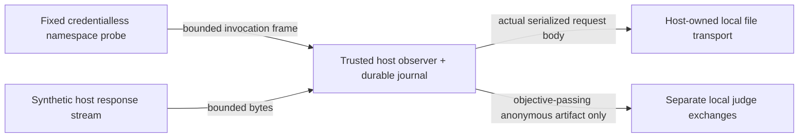

# Codex host boundary — local implementation, not live qualification

## Decision and scope

The driver is an extension-bearing subject that can replace request and finalized-message fields. A parent parser of that subject's JSONL cannot independently observe the provider request. We therefore put request construction, sequence ownership and transport writes in the trusted host, with only bounded invocation frames from the subject. A TLS-interception proxy would require additional certificate/credential authority and is not used.

This is a narrow **local protocol and SDK transport implementation**. It has no credential loader, live network implementation/switch, provider discovery or installation code. The trusted host supplies an installed SDK binding, never subject/extension code. Arbitrary caller-supplied code is not a security sandbox. No live production caller is wired. `qualification-runner-v1`, existing Pi extension-provenance rejection, and producer fixed digest/experiment guards are unchanged.



## Implemented observations and gates

`packages/adapters/src/codex-host-observer.ts` binds frozen invocation IDs, exact installed-catalogue Codex model IDs, requested effort, instructions and inputs. Subject frames cannot supply model, endpoint, payload replacements, sequence gaps or additional fields. The host constructs a deliberately small Codex request-body subset and observes its actual write to the host-owned transport. Journal CAS claims precede writes, failures remain counted, unmatched claims block reopening, no automatic retry is available, and an experiment-wide elapsed deadline plus request/response byte and invocation caps apply. The private journal retains body bytes and digests, not authentication headers.

**Write completion is not provider receipt.** Settings in these bytes are host-requested settings, not independently verified backend identity, effort acceptance or internal reasoning. A digest authenticates neither host nor signer. History integrity assumes a trusted cooperative host/filesystem; it does not resist a malicious same-UID owner rolling back the entire store. The local exchange counter is not a billable/provider-call count.

Judge emission is blocked until the bound subject's byte objective passes. The host builds the judge input from an opaque label, retained output and frozen criterion, not subject identity/cost. First/second judges precede a tie-break, which is admitted only for a clean split. Actual retained vote bytes feed existing `collapseVotePanel`, with immutable panel binding on reopen. No vote executes a controller action or authorizes adoption; routing remains null. Artifact content can itself reveal identity.

Canonical-role checking rejects missing roles, unknown exact catalogue IDs, repeated requested models and repeated/unresolved canonical identities. A frozen policy supplied at owner creation rejects known aliases BEFORE journal creation or request effects; SDK exchanges require that policy. Shared lineage is explicitly disclosed as correlation, and unknown lineage as unknown correlation—not blanket refusal or claimed independent training. A consistent supplied policy is still `CONSISTENT_DECLARATION_ONLY`, never authenticated resolution. Fixtures cannot qualify production judges. Legacy byte-only fixtures remain readable but cannot silently enter the SDK route without a frozen canonical policy.

**Requirement provenance:** build guide run rule 5 (line38) requires distinct canonical roles and disclosure of shared lineage, not different provider families. P09 (lines198–206) requires alias refusal before spend and unsupported unknown resolution; P11 (lines228–234) requires aggregate experiment reservations. No disjoint-lineage mandate was found in the separate frozen qualification-runner contract; that contract and ordinary Pi extension rejection remain unchanged. Earlier local disjoint-lineage refusal was a stricter implementation/draft-charter choice, not an original-spec requirement.

## Separate profile: what actually executes

`codex-model-profile.ts` runs **only fixed IPC-probe code**, not arbitrary models/extensions. The actual Linux process has separate namespaces, read-only `/usr`/runtime binds, no credential/home mount, cleared inherited environment (bubblewrap establishes only `PWD=/`), dropped capabilities, original-handle cancellation, a two-second CPU limit, 64 descriptors, 32MiB V8 heap and bounded output/host elapsed timer. Runtime executables are checked and fingerprinted. A write to the read-only mount is refused; the child network namespace differs from its parent. No network connection is attempted.

This is intentionally named `linux-bwrap-codex-ipc-probe-v1`, **not a qualified model-effect profile**. Per-process CPU and V8 heap are not aggregate descendant/host memory/CPU limits. Client cancellation is not a provider-side deadline or token cap. A model-bearing profile still needs qualified aggregate resource and trusted host egress/credential boundaries; no arbitrary-code launch or weaker substitute is exposed here.

Ordinary unit tests are portable and require no package installation. The separate real-kernel conformance command is explicit and fails, rather than skips or installs, when prerequisites are unavailable:

```sh
node examples/codex-local-boundary/probe.mjs /absolute/new/private/evidence-directory
```

It uses built `packages/adapters/dist`, already-installed Linux bubblewrap/prlimit/Node, a real isolated child frame, actual host-owned file writes, synthetic response streams, and a durable objective-before-blind split panel. It records `liveCalls: 0` and `liveQualified: false`. It does not exercise the SDK's final compressed HTTP/SSE wire format or attest backend responses.

## Integrated SDK transport: inert compatibility only

`codex-sdk-transport.ts` connects `exchangeSdk` to the installed SDK serializer, zstd compression and response decoder. A claim precedes the SDK; the host compares final decoded request semantics against its frozen body, retains actual serialized/compressed bytes and hashes, bounds raw responses, validates event sequence/correlation/completion, refuses replayed response IDs, and compares actual SDK-decoded text before objective eligibility. Records use the existing journal, not another store. Canonical declarations are frozen before SDK effects. SDK metadata is not provider attestation.

The deliberately narrow supported stream is created → one assistant text item → text deltas → completed item → completed response. Other shapes (including tools/reasoning or additional event types) are **unsupported**, never a qualified empty success. This is not a general Codex stream implementation. HTTP/SSE bytes are exercised through a host-owned **inert fetch seam**, not a live socket: only an invalid fixture credential exists; auth loading, real network, redirects/fallback and SDK retries are unavailable. Ordinary Pi extension-bearing measurement rejection is unchanged.

`examples/codex-local-boundary/sdk-proof.mjs` exercises actual installed SDK success, malformed/truncated/reordered/miscorrelated responses, changed settings, wire tampering, quota, attempted retry, size bound, response replay and objective-before-blind panel. Run ONLY inside the same network-unshared/no-home fixture mount, with built harness and already-installed SDK/Node; no installs or model catalogue/auth probes:

```sh
# Supply absolute SDK installation and fresh private OUT paths; no credential directory.
mkdir -m 700 "$OUT"
bwrap --unshare-all --die-with-parent --new-session \
  --ro-bind /usr /usr --ro-bind /lib /lib --ro-bind /lib64 /lib64 \
  --proc /proc --dev /dev --tmpfs /tmp \
  --ro-bind "$(command -v node)" /node --ro-bind "$SDK" /sdk \
  --ro-bind "$PWD" /harness --bind "$OUT" /out --clearenv --chdir / \
  /node /harness/examples/codex-local-boundary/sdk-proof.mjs
```

This pins the local trust boundary, not arbitrary-caller containment or aggregate model-resource qualification. Request body/wire and response bytes remain synthetic; no credential, backend identity or live acceptance authority follows.

## Subscription-only future boundary

Only the user's existing **`openai-codex` ChatGPT subscription** may be considered for future evaluated proposer, subject or judge calls. Installed source maps this to `POST https://chatgpt.com/backend-api/codex/responses`. The provider declares OAuth `isSubscription: true`; its adapter uses a Bearer OAuth access token and ChatGPT account claim. These are source observations, not verification of this user's credentials, entitlement or remaining quota. Credential values must never be exposed during preparation. An explicitly requested `pi auth check --provider openai-codex --json --no-refresh` may read the configured store internally, but emits only readiness/provider/auth-type metadata. Do not use `--credentials`; the default check without `--no-refresh` can refresh OAuth and is outside local-only authority.

The private campaign proposal, outside this repository, lists exact candidates and payloads. Installed model IDs alone do not resolve canonical aliases. Shared family/lineage is a disclosed correlation limitation, not an impossible separation requirement: distinct canonical proposer/subject/judges can share a family. Fresh contexts do not cure self-judging. Supplied canonical mappings still need justified resolution before claims relying on them.

Installed Codex source defaults to transport fallback/retry, so a future approved host must force SSE and `maxRetries: 0`, deny redirects/proxies/custom destinations, and stop on any quota/access/usage-limit failure. No refresh, login, alternative account, credits, usage-reset redemption, API key, metered route or paid fallback is authorized. Even OAuth refresh at `https://auth.openai.com/oauth/token` is excluded from the current proposal.

The inspected request builder does not emit `max_output_tokens` from its output-token option. Do not invent backend support or equate a stream byte bound with a server generation limit. This limits the proposed hard-server-token-cap charter, not subscription-only execution inherently or the original spec universally. The original spec still requires frozen aggregate resource reservations; the draft's exact server token/cgroup numbers must not be substituted for those requirements.

**Current external authorization: zero calls.** Root must inspect exact destinations/models/data/credential mechanism/call-token-time-cost caps/isolation and give bounded execution approval. Original CHANGES-REQUESTED, unmeasured gates and pending native acceptance remain unchanged. No merge authority is delegated.
